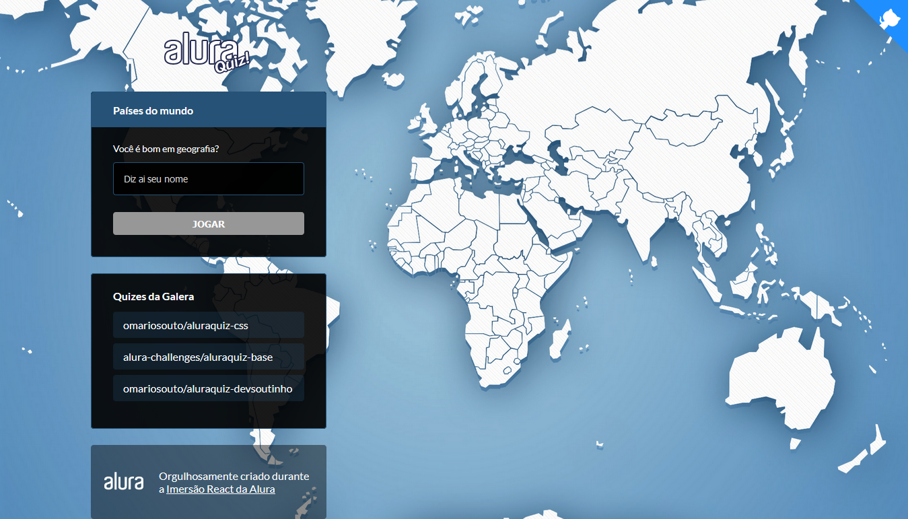

<h1 align="center">
   
</h1>

  <a href="#-tecnologias">Tecnologias</a> &nbsp;&nbsp;&nbsp;|&nbsp;&nbsp;&nbsp;
  <a href="#-licença">Licença</a>

# Imersão React 2ª Edição: Next.JS 
Projeto construído durante a <a href="https://github.com/alura-challenges/aluraquiz-base">Imersão React Next.JS da Alura</a>

<a href="https://quiz-geografia.brunobecoski.vercel.app">Ver online</a>

  

 

## 🚀 Tecnologias 

Esse projeto foi desenvolvido com as seguintes tecnologias:

* [React Js](https://reactjs.org)
* [Next.JS](https://nextjs.org)

 

## 📝 Licença 
Esse projeto está sob a licença MIT. Veja o arquivo [LICENSE](LICENSE.md) para mais detalhes.
